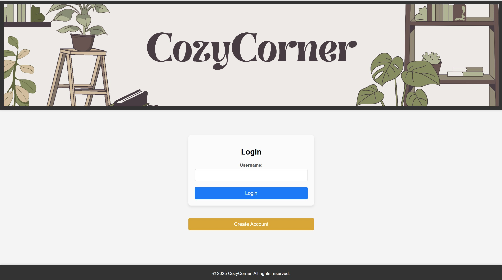
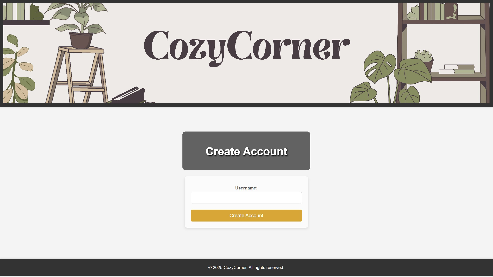
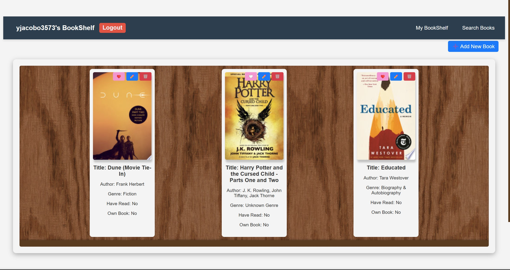
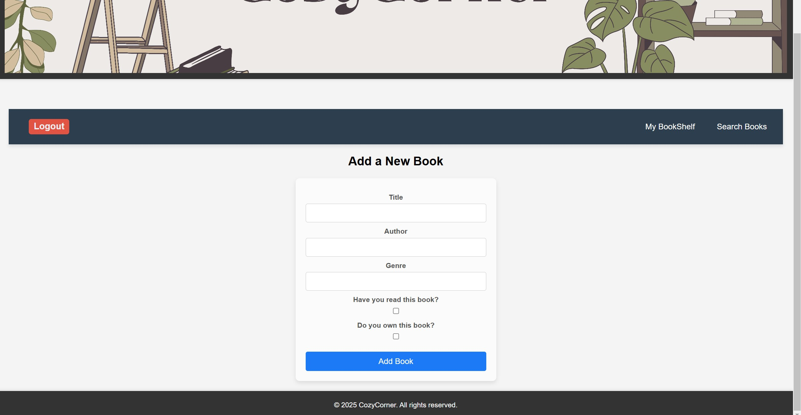
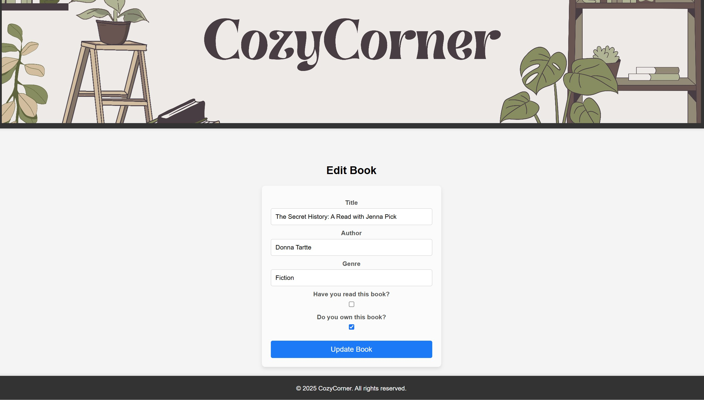
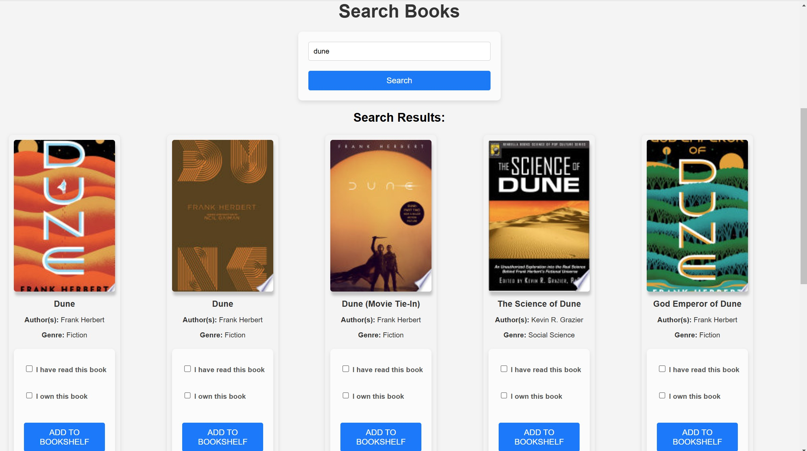

# <h1 align="center">📚 CozyCorner 📚</h1>

---

## <h2 align="center"> Description </h2>

**Your Personal Book Collection, Simplified**

Stay on top of your reading progress with our **intuitive app**.  
Add books to your collection, categorize them by reading status, and view essential **details** like titles, authors,
and reading status.  
Easily **search** for specific books, and update your collection to reflect **new reads** or books you no longer own.

---

## <h2 align="center"> Setup Instructions </h2>

1. **Clone Repository from GitHub**

```
git clone https://github.com/LoganPickell/AgileArchitects_ModernSoftwareDevelopment.git
```

2. **Create a virtual environment** (optional but recommended):

```
python -m venv venv
```

3. **Activate the virtual environment**:
    - **Windows**:
      ```
      .\venv\Scripts\activate
      ```
    - **Mac/Linux**:
      ```
      source venv/bin/activate
      ```

4. **Install dependencies using** `requirements.txt`:

```
pip install -r requirements.txt
```

5. **Run the app**:

```
python app.py
```

---

## <h2 align="center"> How to Use the App </h2>

#### 1. Create your account! 💻
1. Click "Create Account" and create a username
2. Login with your username

#### 2. Find books! 📖
* Go to "Add New Book" to manually add a book to your bookshelf
* Go to "Search Books" to find any book by its title or author

    * Ex. Search "Stephen King" to find all of his books
    * Ex. Search "Twilight" to find the specific book itself
* If you have read the book before, check "Have you read this book?"
* If you own the book, check "Do you own this book?"
#### 3. Look at what's in your bookshelf! 👀
* You may edit book details by clicking the pencil icon ✏️
* You may delete books from your bookshelf by clicking the trash icon 🗑️
#### 4. Ensure you logout! 😁
* Simply go to your bookshelf and press "Logout" next to the welcome message

---

## <h2 align="center"> Screenshots </h2>








