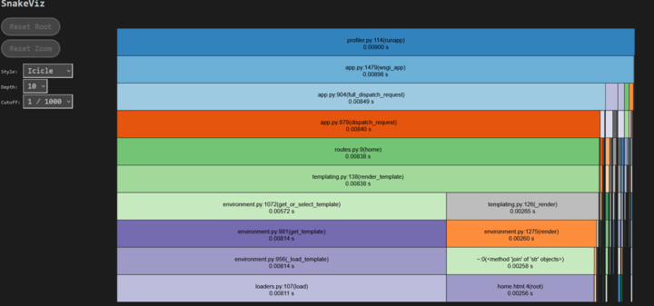

# Dynamic Analysis Modules

This document describes the dynamic analysis used for the Cozy Corner App and how to execute it

### Code Coverage
___

Code coverage is run using:

    coverage run -m pytest

The coverage document is stored root folder of the application and is labeled as ".coverage". 

Coverage can be viewed in PyCharm by pressing "Ctrl + Alt + F6" and selecing the coverage suite from the root folder of the project.

A new user can install coverage through pip in their terminal:

    pip install coverage

___

### Werkzeug Middleware Profiler

___

Cozy Corner uses Werkzeug Middleware Profiler for dynamic analysis of the application.  
This profiler saves the reports it generates in the profiles folder,
which is located in the root directory of the application.

In order to perform profiling of the application, it must be run through the terminal.  

In Powershell type:

    $env:PROFILE = "true"
    py run.py

In bash terminal type:

    set PROFILE=true
    py run.py
 
The profile will run while the program is in use and record all profiles from all scripts so 
the user can examine them during or after application execution.

It is recommended to view the profiles using snakeviz, which can be installed by using the terminal and typing:

    pip install snakeviz

To use snakeviz after profiling, enter:

    snakeviz ./profiles/<enter the filename to view>

Example snakeviz image:

