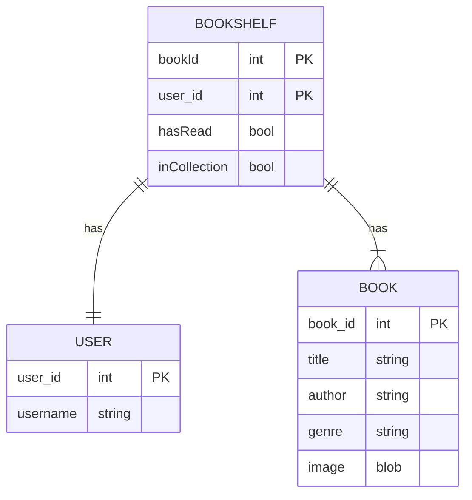

# Planning Document for Agile Architects Book Tracker App

```mermaid
erDiagram

USER{
    user_id int PK
    username string
}

BOOK {
    book_id int PK
    title string
    author string
    genre string
    image blob
    
}


BOOKSHELF {
    bookId int  PK
    user_id int PK
    hasRead bool
    inCollection bool
}


BOOKSHELF ||--|| USER : has
BOOKSHELF ||--|{ BOOK : has


```
