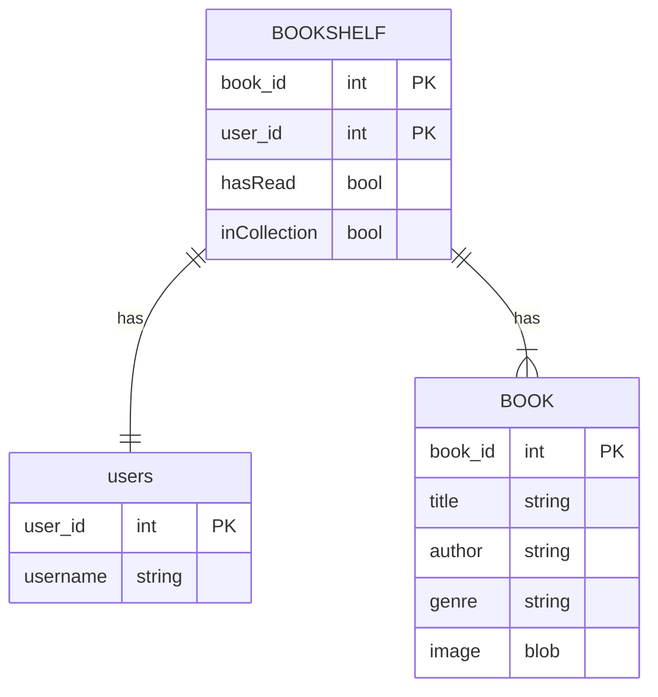
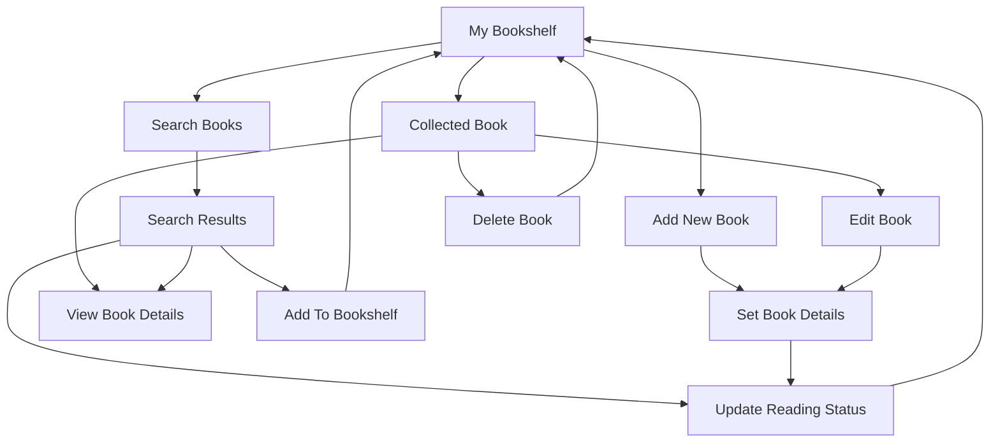

# Planning Document for Agile Architects Book Tracker App

## App Description
Stay on top of your reading progress with our intuitive app. Add books to your collection, categorize them by reading status, and view essential details like titles, authors, and genre. Easily search for specific books, and update your collection to reflect new reads or books you own.

---
## Feature List

### Required Features:
* Include a search bar to find books by title or author
* The ability to add books to users' bookshelves
* The ability to delete books from the users' bookshelves
  
### Should Have Features:
* The ability to manually edit book details in bookshelves
* The ability to mark books as "Have read" and "Own"
### Nice To Have Features:
* Include citations within book details
* The ability to share bookshelves with others
* Display recommended books in users' bookshelves
---
## User Stories

1. As a user, I want to add books to my collection, so that I can track what I own and have read.
2. As a user, I want to mark books as “Read”, “Currently Reading”,  or “To-Read” so that I can organize my reading progress.
3. As a user, I want to view details about a specific book, including its title, author, and description, so that I can remember important information about each book.
4. As a user, I want to be able to search for books by title or author, so that I can easily find books in my collection.
5. As a user, I want to edit or delete books from my collection, so that I can keep my list up to date. 

---
## Database Schema (ERD)

---
## User Flow Diagram

---
## List of Endpoints

| Method | Endpoint | Description | Authorization |
|--------|----------|-------------|---------------|
| GET    | / | Display home page( A.K.A login page) | Everyone |
| POST   | / | Submit username that will be validated. | Everyone |
| GET    | /create_account | Display create account form page. | Everyone |
| POST   | /create_account | Submit new user creation request and store in database. | Everyone |
| GET    | /userBookShelf | Display all books added by the user to their bookshelf. | User |
| GET    | /add_book      | Display add book page.                                 | User |
| POST   | /add_book      | Inserts book into the database and redirects to /userBookShelf | User |
| GET    | /edit_book/<int:book_id> | Display edit book page. | User |
| POST   | /edit_book/<int:book_id> | Modifies book in database and redirects to /userBookShelf | User |
| POST | /delete_book/<int:book_id> | Delete a book from the user's bookshelf | User |
| GET    | /search_books | Display search books page. | User |
| POST   | /search_books | Adds a book from search results to the user's bookshelf | User |
| GET    | /logout       | Displays home page. | User |
