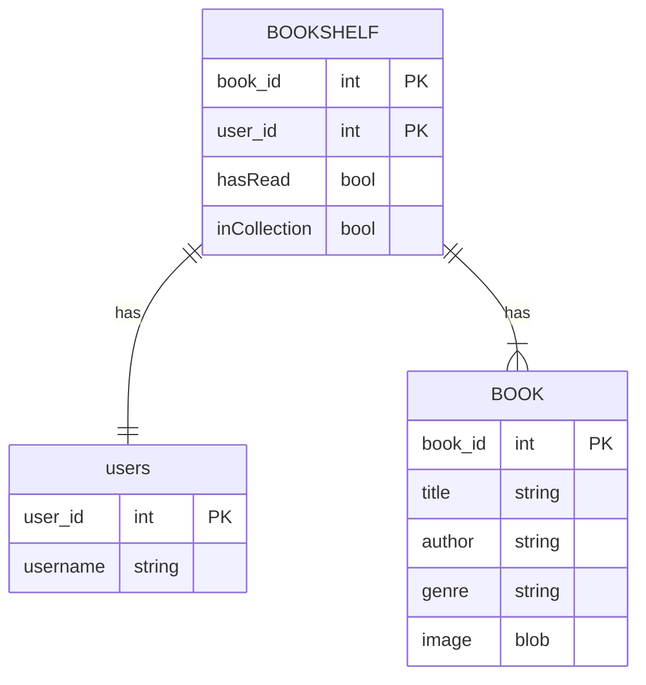
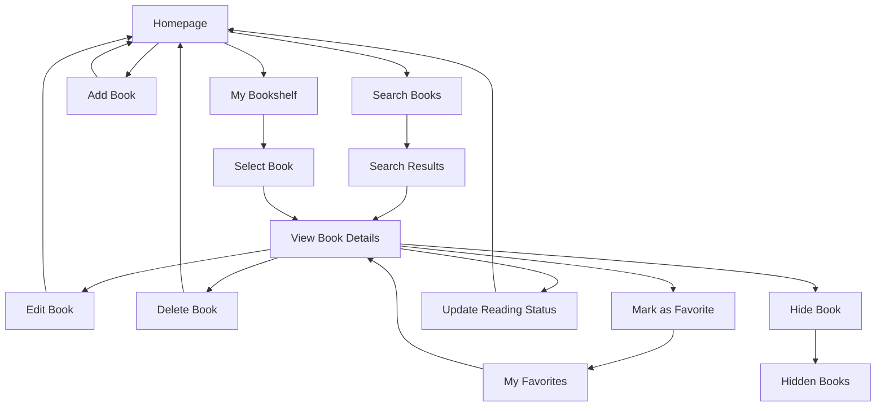

# Planning Document for Agile Architects Book Tracker App

---

---
| Method | Endpoint | Description | Authorization |
|--------|----------|-------------|---------------|
| GET    | /homepage | Display account creation and login options | Everyone |
| GET    | /homepage | Display search bar and book recommendations | User |
| POST   | /homepage/<book_id> | Add a new book to the user's bookshelf or favorites | User |
| POST   | /login | Submit login request and authenticate user using username | Everyone |
| GET    | /create_account | Display create account form | Everyone |
| POST   | /create_account | Submit new user creation request and store in database | Everyone |
| GET    | /dashboard | Display all books added by the user to their bookshelf | User |
| DELETE | /dashboard/<book_id> | Delete a book from the user's collection | User |
| GET    | /favorites | Display a page with all the user's favorite books | User |
| DELETE | /favorites/<book_id> | Delete a book from the user's favorites | User |
| PUT    | /dashboard/<book_id>/status | Update the reading status (Read, Currently Read, To-Read) | User |
| GET    | /search_books | Search for books by title or author | User |
| POST   | /search_books/<book_id>/add | Add a book from search results to the user's bookshelf | User |
| POST   | /search_books/<book_id>/favorite | Add a book from search results to the user's favorites | User |
| GET    | /book/<book_id> | Display detailed info about a specific book | User |
