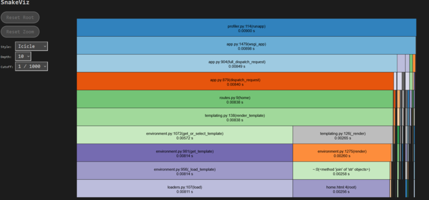

# Planning Document for Agile Architects Book Tracker App

## App Description
Stay on top of your reading progress with our intuitive app. Add books to your collection, categorize them by reading status, and view essential details like titles, authors, and genre. Easily search for specific books, and update your collection to reflect new reads or books you own.

---
## Feature List

### Required Features:
* Include a search bar to find books by title or author
* The ability to add books to users' bookshelves
* The ability to delete books from the users' bookshelves
  
### Should Have Features:
* The ability to manually edit book details in bookshelves
* The ability to mark books as "Have read" and "Own"
### Nice To Have Features:
* Include citations within book details
* The ability to share bookshelves with others
* Display recommended books in users' bookshelves
---
## User Stories

1. As a user, I want to add books to my collection, so that I can track what I own and have read.
2. As a user, I want to mark books as “Own” or “Have read."
3. As a user, I want to view details about a specific book, including its title, author, and genre, so that I can remember important information about each book.
4. As a user, I want to be able to search for books by title or author, so that I can easily find books.
5. As a user, I want to edit or delete books from my collection, so that I can keep my list up to date. 

---
## Database Schema (ERD)

---
## User Flow Diagram

---
## List of Endpoints

| Method | Endpoint | Description | Authorization |
|--------|----------|-------------|---------------|
| GET    | / | Display home page( A.K.A login page) | Everyone |
| POST   | / | Submit username that will be validated. | Everyone |
| GET    | /create_account | Display create account form page. | Everyone |
| POST   | /create_account | Submit new user creation request and store in database. | Everyone |
| GET    | /userBookShelf | Display all books added by the user to their bookshelf. | User |
| GET    | /add_book      | Display add book page.                                 | User |
| POST   | /add_book      | Inserts book into the database and redirects to /userBookShelf | User |
| GET    | /edit_book/<int:book_id> | Display edit book page. | User |
| POST   | /edit_book/<int:book_id> | Modifies book in database and redirects to /userBookShelf | User |
| POST | /delete_book/<int:book_id> | Delete a book from the user's bookshelf | User |
| GET    | /search_books | Display search books page. | User |
| POST   | /search_books | Adds a book from search results to the user's bookshelf | User |
| GET    | /logout       | Displays home page. | User |

## New Feature

We added a new feature in our user bookshelf page that gives the
user the option to favorite a book. Moreover, we made this highly intutive
by using a clickable heart icon. The user can undo this by clicking
the icon again.

## Task Assignments

This time around we organized our tasks with a mixture of a Kanban Board and
GitHub Issues. We simply created issues for every task and then attached them to our Kanban Board.
Additionally, we created three columns on our board which were: to-do, in-progress, and completed.
Every team member was assigned a task, was responsible for moving their task to the respective
column, and had to close the issue associated with their task.

Below is a link displaying the Kanban Board:
https://trello.com/invite/b/67ec719b91c160db1d1fcbe4/ATTIdf83f5e18cfd92620881c2a68dc4facd9D781BC2/modern-software-dev

## Analysis Tools Used
### Static Analysis Modules
#### Pylint

pylint is used running:

    pylint script.py

We thoroughly examined our routes.py file using pylint and some of our
problems were:
   - routes.py:89:0: C0301: Line too long (111/100) (line-too-long)
   - routes.py:108:0: C0301: Line too long (117/100) (line-too-long)
   - routes.py:128:0: C0301: Line too long (107/100) (line-too-long)
   - routes.py:4:0: C0411: standard import "re" should be placed before third party import "flask.render_template" and local imports "models.User", ".db" (wrong-import-order)
   - routes.py:5:0: C0411: third party import "requests" should be placed before local imports "models.User", ".db" (wrong-import-order)

We managed to fix these problems, and we increased our score to 9.5/10.

#### Flake8

flake8 is used running:
    
    flake8 script.py

We thoroughly examined our routes.py file using flake8 and some of our
problems were:
- routes.py:85:9: E122 continuation line missing indentation or outdented
- routes.py:88:80: E501 line too long (85 > 79 characters)
- routes.py:90:13: E128 continuation line under-indented for visual indent

We made sure to shorten our lines and fixed the indentations.

### Dynamic Analysis Modules

This document describes the dynamic analysis used for the Cozy Corner App and how to execute it

#### Code Coverage
___

Code coverage is run using:

    coverage run -m pytest

The coverage document is stored root folder of the application and is labeled as ".coverage". 

Coverage can be viewed in PyCharm by pressing "Ctrl + Alt + F6" and selecing the coverage suite from the root folder of the project.

A new user can install coverage through pip in their terminal:

    pip install coverage

___

#### Werkzeug Middleware Profiler

___

Cozy Corner uses Werkzeug Middleware Profiler for dynamic analysis of the application.  
This profiler saves the reports it generates in the profiles folder,
which is located in the root directory of the application.

In order to perform profiling of the application, it must be run through the terminal.  

In Powershell type:

    $env:PROFILE = "true"
    py run.py

In bash terminal type:

    set PROFILE=true
    py run.py
 
The profile will run while the program is in use and record all profiles from all scripts so 
the user can examine them during or after application execution.

It is recommended to view the profiles using snakeviz, which can be installed by using the terminal and typing:

    pip install snakeviz

To use snakeviz after profiling, enter:

    snakeviz ./profiles/<enter the filename to view>

Example snakeviz image:

